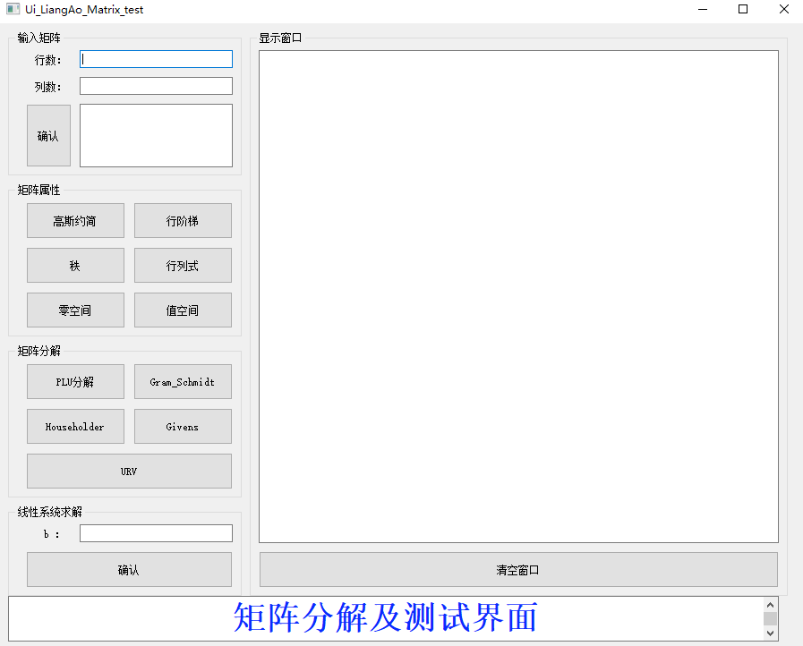

# 矩阵分析与应用

# 引言

本项目严格依据Python库文件的编写要求编写，所有功能实现的程序都储存在factorization文件夹中，实例的所有功能都封装在$Matrix$对象中。从外部调用可实现程序的功能，封装的矩阵功能有：矩阵行阶梯表示、矩阵的秩、矩阵的零空间、矩阵的值空间、矩阵的PLU分解、矩阵的逆、Gram-Schmidt正交化、Householder正交约简、Givens约简、URV分解还有基于这些功能实现的矩阵的行列式和$Ax = b$的线性系统的求解。

实现过程中，除了必要的如“矩阵表达->numpy”，“数据拷贝->copy”用了相应的第三方库外，其余均从头实现。在程序文件中，也都清楚的注释了各个功能功能介绍和实现方式。对于项目中各对象的继承过程，功能的传递过程详情见./factorization/\_\_init\_\_.py中。

为更进一步的完善项目，增加调试的便捷性，同时设计了项目实现的GUI，实现程序为MatrixGUI.py，在GUI中可以更灵活的进行功能测试。下面将具体阐述项目的环境要求和测试过程。

## 运行环境及编译工具

- Windows
- VS Code

## 编程语言及库版本

| 库         | 版本   |
| ---------- | ------ |
| Python     | 3.7.0  |
| copy       | 无     |
| numpy      | 1.19.2 |
| PyQt5      | 5.15.4 |

## 文件树

### 程序库
- factorization
    - \_\_init\_\_.py
    - lu_factorization.py
    - matrix.py
    - matrixtools.py
    - qr_factorization.py
    - urv_factorization.py
    
### 测试程序 
- test.py

### GUI
- MatrixGUI.py

# 测试过程

## 矩阵的行阶梯表示->rref()

### 设计思路
主要是运用高斯约旦法，将主元置1，并将主元所在列的其他元素置零，实现过程运用了矩阵基本运算的后两种。需要注意的有
- 在进行基本运算时，要杜绝分母是零的情况
- 由于计算要求，矩阵格式应是float类型，但由于numpy对浮点数计算精度过高经常出现极小但不为零的情况，如$1.230512e-16$，此时应判断后置零，否则会极大的影响后面对于矩阵秩的判断

### 测试


```python
# 所有功能均封装在Matrix中
from factorization import Matrix
import numpy as np
a = np.array([[1,1,2,2,1],
              [2,2,4,4,3],
              [2,2,4,4,2],
              [3,5,8,6,5]])
# 实例化对象
test = Matrix(a)
# 调用rref()
test.rref()
```


    array([[ 1.,  0.,  1.,  2.,  0.],
           [ 0.,  1.,  1.,  0.,  0.],
           [-0., -0., -0., -0.,  1.],
           [ 0.,  0.,  0.,  0.,  0.]])


## 矩阵的秩->rank()

### 基本思路
由矩阵的行阶梯表示可以很容易的得到矩阵的秩，只用判断每行中是否所有元素都是0，所以上述对极小的判断就非常重要

### 测试


```python
# 接着使用上面的实例化对象
# 调用rank()
test.rank()
```


    3


## 矩阵的零空间->nullspace()

### 基本思路
零空间即为$Ax=0$中的$x$，由于得出了矩阵的行阶梯表示和矩阵的秩，当矩阵是满秩阵时零空间只有零元素，非满秩矩阵时需找出自由变量，并依据行阶梯表示进行计算

### 测试


```python
# 接着使用上面的实例化对象
# 调用nullspace()
test.nullspace()
```


    array([[-1., -2.],
           [-1., -0.],
           [ 1.,  0.],
           [ 0.,  1.],
           [ 0.,  0.]])


## 矩阵的值空间->columnspace()

### 基本思路
值空间是矩阵的列空间，是主元所在的列，当矩阵是满秩矩阵时值空间就是它本身，否则由行阶梯表示得到的主元所在的列也可求出

### 测试


```python
# 接着使用上面的实例化对象
# 调用columnspace()
test.columnspace()
```


    array([[2., 2., 1.],
           [4., 4., 3.],
           [4., 4., 2.],
           [8., 8., 5.]])


## 矩阵的值空间->PLU_factorization()

### 基本思路
矩阵的PLU分解主要是高斯约简的过程，过程中将最大的元素挪到上方作为主元，并在P矩阵中存储移动过程，需要注意有
- 分解的矩阵需要是非奇异阵，否则分母元素可能为零

### 测试


```python
# 在上面已经调用过库，在这里只更改测试矩阵a
# from factorization import Matrix
# import numpy as np
a = np.array([[1,2,-3,4],
              [4,8,12,-8],
              [2,3,2,1],
              [-3,-1,1,-4]])
# 实例化对象
test = Matrix(a)
# PLU_factorization()()
test.PLU_factorization()
```


    (array([[0., 1., 0., 0.],
            [0., 0., 0., 1.],
            [1., 0., 0., 0.],
            [0., 0., 1., 0.]], dtype=float32),
     array([[ 1.        ,  0.        ,  0.        ,  0.        ],
            [-0.75      ,  1.        ,  0.        ,  0.        ],
            [ 0.25      ,  0.        ,  1.        ,  0.        ],
            [ 0.5       , -0.2       ,  0.33333334,  1.        ]],
           dtype=float32),
     array([[  4.,   8.,  12.,  -8.],
            [  0.,   5.,  10., -10.],
            [  0.,   0.,  -6.,   6.],
            [  0.,   0.,   0.,   1.]], dtype=float32))


## 矩阵的逆->get_inversion()

### 基本思路
由矩阵的PLU分解可以有效处理$Ax = b$的情况，当b分别是单位阵的每一列时，我们求得的$x$就是矩阵$A^{-1}$的每一列

### 测试


```python
# 接着使用上面的实例化对象
# get_inversion()
test.get_inversion()
```

    逆矩阵为： 
     [[ 0.16666669  0.25833336 -1.         -0.6       ]
     [ 0.3333333   0.06666665  0.          0.2       ]
     [-0.5        -0.22499998  1.          0.2       ]
     [-0.33333334 -0.26666665  1.          0.2       ]]


    array([[ 0.16666669,  0.25833336, -1.        , -0.6       ],
           [ 0.3333333 ,  0.06666665,  0.        ,  0.2       ],
           [-0.5       , -0.22499998,  1.        ,  0.2       ],
           [-0.33333334, -0.26666665,  1.        ,  0.2       ]],
          dtype=float32)


## Gram-Schmidt正交化->Gram_Schmidt_orthogonalization()

### 基本思想
$$
\mathbf{q}_{1}=\frac{\mathbf{a}_{1}}{\nu_{1}} \quad \text { and } \quad \mathbf{q}_{k}=\frac{\mathbf{a}_{k}-\sum_{i=1}^{k-1}\left\langle\mathbf{q}_{i} \mid \mathbf{a}_{k}\right\rangle \mathbf{q}_{i}}{\nu_{k}} \quad \text { for } k=2,3, \ldots, n
$$
$$\nu_{1}=\left\|\mathbf{a}_{1}\right\| \qquad \nu_{k}=\left\|\mathbf{a}_{k}-\sum_{i=1}^{k-1}\left\langle\mathbf{q}_{i} \mid \mathbf{a}_{k}\right\rangle \mathbf{q}_{i}\right\| \qquad k>1$$
$$
\left(\mathbf{a}_{1}\left|\mathbf{a}_{2}\right| \cdots \mid \mathbf{a}_{n}\right)=\left(\mathbf{q}_{1}\left|\mathbf{q}_{2}\right| \cdots \mid \mathbf{q}_{n}\right)\left(\begin{array}{ccccc}
\nu_{1} & \left\langle\mathbf{q}_{1} \mid \mathbf{a}_{2}\right\rangle & \left\langle\mathbf{q}_{1} \mid \mathbf{a}_{3}\right\rangle & \cdots & \left\langle\mathbf{q}_{1} \mid \mathbf{a}_{n}\right\rangle \\
0 & \nu_{2} & \left\langle\mathbf{q}_{2} \mid \mathbf{a}_{3}\right\rangle & \cdots & \left\langle\mathbf{q}_{2} \mid \mathbf{a}_{n}\right\rangle \\
0 & 0 & \nu_{3} & \cdots & \left\langle\mathbf{q}_{3} \mid \mathbf{a}_{n}\right\rangle \\
\vdots & \vdots & & \vdots & \ddots  \\
0 & 0 & 0 & \cdots & \nu_{n}
\end{array}\right)
$$

需要注意的是：
- Gram-Schmidt正交化中的矩阵应是列线性无关的

### 测试


```python
# 在上面已经调用过库，在这里只更改测试矩阵a
# from factorization import Matrix
# import numpy as np
a = np.array([[0,-20,-14],
              [3,27,-4],
              [4,11,-2]])
# 实例化对象
test = Matrix(a)
# Gram_Schmidt_orthogonalization()
test.Gram_Schmidt_orthogonalization()
```


    (array([[ 0.  , -0.8 , -0.6 ],
            [ 0.6 ,  0.48, -0.64],
            [ 0.8 , -0.36,  0.48]]), array([[ 5., 25., -4.],
            [ 0., 25., 10.],
            [ 0.,  0., 10.]]))


## Householder reduction->Householder_reduction()

### 基本思想
基于反射矩阵的思想，逐步的将每一列（子矩阵）反射到第一坐标轴上

### 测试


```python
# 接着使用上面的实例化对象
# Householder_reduction()
test.Householder_reduction()
```


    (array([[ 0.  ,  0.6 ,  0.8 ],
            [-0.8 ,  0.48, -0.36],
            [-0.6 , -0.64,  0.48]]),
     array([[ 5.00000000e+00,  2.50000000e+01, -4.00000000e+00],
            [ 0.00000000e+00,  2.50000000e+01,  1.00000000e+01],
            [ 0.00000000e+00, -1.33226763e-15,  1.00000000e+01]]))


## Givens reduction->Givens_reduction()

### 基本思想
利用旋转矩阵的思想，逐步将元素（子矩阵）旋转到第一坐标轴上
$$
\mathbf{P}_{i j}=\left(\begin{array}{ccccccccc}
1 & & & & & & & & & \\
& \ddots & & & & & & & \\
& & c & & & s & & & \\
& & & 1 & & & & & \\
& & & & \ddots & & & & \\
& & -s & & & c & & & \\
& & & & & & 1 & & \\
& & & & & & & \ddots & \\
& & & & & & & & 1
\end{array}\right)
$$

### 测试


```python
# 接着使用上面的实例化对象
# Givens_reduction()
test.Givens_reduction()
```


    (array([[ 0.  ,  0.6 ,  0.8 ],
            [-0.8 ,  0.48, -0.36],
            [-0.6 , -0.64,  0.48]]),
     array([[ 5.00000000e+00,  2.50000000e+01, -4.00000000e+00],
            [ 2.66453526e-16,  2.50000000e+01,  1.00000000e+01],
            [-3.55271368e-16, -3.10862447e-16,  1.00000000e+01]]))


## URV分解->URV_factorization()

### 基本思想
### 测试


```python
# 接着使用上面的实例化对象
# URV_factorization()
test.URV_factorization()
```


    (array([[ 0.  , -0.8 , -0.6 ],
            [ 0.6 ,  0.48, -0.64],
            [ 0.8 , -0.36,  0.48]]),
     array([[ 2.58069758e+01,  1.36696280e-16, -8.77596167e-16],
            [ 2.26682896e+01,  1.45309548e+01, -1.43603192e-16],
            [-1.54996852e+00,  9.29981110e+00,  3.33333333e+00]]),
     array([[ 0.19374606,  0.96873032, -0.15499685],
            [-0.30224386,  0.20924575,  0.92998111],
            [ 0.93333333, -0.13333333,  0.33333333]]))


## 矩阵的行列式->det()

### 基本思想
由于只有方阵才有行列式，所以我们可以依靠PLU分解来实现求解矩阵的行列式。在计算之前判断矩阵是否满秩，是则用PLU分解求解，不是时返回0，因为非奇异阵的行列式为0.

### 测试


```python
# 接着使用上面的实例化对象
# det()
test.det()
```


    1250.0


## $Ax = b$求解

### 基本思想
- 当$b = 0$时
    - 当A为满秩矩阵时，返回零元素
    - 当A非满秩时，有无数解
    - 可以调用上面的nullspace()函数返回A的零空间
- 当$b \neq 0$
    - 当$rank(A) \neq rank([A|b])$时，无解
    - 当$rank(A) = rank([A|b])$时
        - 当$rank(A) = rank([A|b]) = ncol$时，有唯一解，用PLU分解求解
        - 否则，有无数解，由通解和特解组成

### 测试


```python
# 在上面已经调用过库，在这里只更改测试矩阵a
# from factorization import Matrix
# import numpy as np
a = np.array([[1,1,2,2,1],
              [2,2,4,4,3],
              [2,2,4,4,2],
              [3,5,8,6,5]])
b = np.array([1,1,2,3])
# 实例化对象
test = Matrix(a)
# linear_equation()
test.linear_equation(b)
# 返回前半部分是特解，后半部分通解
```


    [array([ 1.,  1.,  0.,  0., -1.]), array([[-1., -2.],
            [-1., -0.],
            [ 1.,  0.],
            [ 0.,  1.],
            [ 0.,  0.]])]


# GUI测试->MatrixGUI.py

## 启动


```python
# jupyter notebook中启动
%run MatrixGUI.py
# 外部启动
# python MatrixGUI.py
```



## 输入矩阵

矩阵采用输入行，列，和矩阵元素进行输入，如下图

## 功能测试
点击相应按钮进行功能测试

# 致谢

>@Time    : 2021/11/26 22:49
>@Author  : AlanLiang
>@Software: VS Code
>@Github  ：https://github.com/AlanLiangC
>@Blog    : https://AlanLiangC.github.io


```python

```
